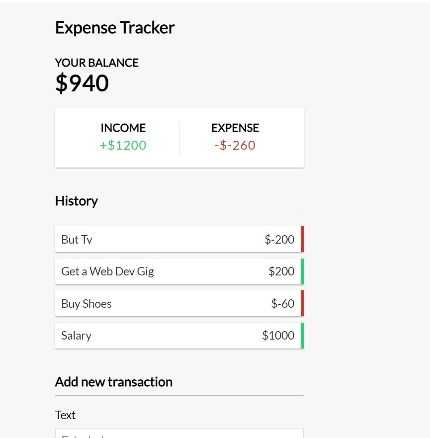

  
  <br/>

  <h3><b>Microverse README Template</b></h3>

</div>

<!-- TABLE OF CONTENTS -->

# 📗 Table of Contents

- [📖 About the Project](#about-project)
  - [🛠 Built With](#built-with)
    - [Tech Stack](#tech-stack)
    - [Key Features](#key-features)
  - [🚀 Live Demo](#live-demo)
- [💻 Getting Started](#getting-started)
  - [Prerequisites](#prerequisites)
  - [Setup](#setup)
  - [Install](#install)
  - [Usage](#usage)
  - [Run tests](#run-tests)
  - [Deployment](#deployment)
- [👥 Authors](#authors)
- [🔭 Future Features](#future-features)
- [🤝 Contributing](#contributing)
- [⭐️ Show your support](#support)
- [🙏 Acknowledgements](#acknowledgements)
- [❓ FAQ (OPTIONAL)](#faq)
- [📝 License](#license)

<!-- PROJECT DESCRIPTION -->

# 📖 [Expense Tracker] <a name="about-project"></a>

**[Expense Tracker]** is what it sounds like. An expense tracking web app to keep you on toes as far as your spending habits are concerned

## 🛠 Built With <a name="built-with">

    - Vue 3.3
    - Composition API
    - Local Storage

</a>

### Tech Stack <a name="tech-stack">

    - Front End JavaScript

</a>

<details>
  <summary>Client</summary>
  <ul>
    <li><a href="https://vuejs.org/">Vue.js</a></li>
  </ul>
</details>

<!-- Features -->

## 💻 Getting Started <a name="getting-started"></a>

### Prerequisites

In order to run this project you need:

```sh
 npm install
```

### Setup

Clone this repository to your desired folder:

```sh
  cd my-folder
  git clone https://github.com/cyrilmuchemi/Expense-Tracker
```

--->

### Install

Install this project with:

```sh
  cd Expense-Tracker
  npm install
```

--->

### Usage

To run the project, execute the following command:

```sh
  npm run dev
```

<p align="right">(<a href="#readme-top">back to top</a>)</p>

<!-- AUTHORS -->

## 👥 Authors <a name="authors"></a>

👤 **Author1**

- GitHub: [@cyrilmuchemi](https://github.com/cyrilmuchemi)
- Twitter: [@cyrilmuchemi](https://twitter.com/cyrilmuchemi)
- LinkedIn: [cyrilmuchemi](https://linkedin.com/in/cyrilmuchemi)

## 📝 License <a name="license"></a>

This project is [MIT](./LICENSE) licensed.

_NOTE: we recommend using the [MIT license](https://choosealicense.com/licenses/mit/) - you can set it up quickly by [using templates available on GitHub](https://docs.github.com/en/communities/setting-up-your-project-for-healthy-contributions/adding-a-license-to-a-repository). You can also use [any other license](https://choosealicense.com/licenses/) if you wish._

<p align="right">(<a href="#readme-top">back to top</a>)</p>
